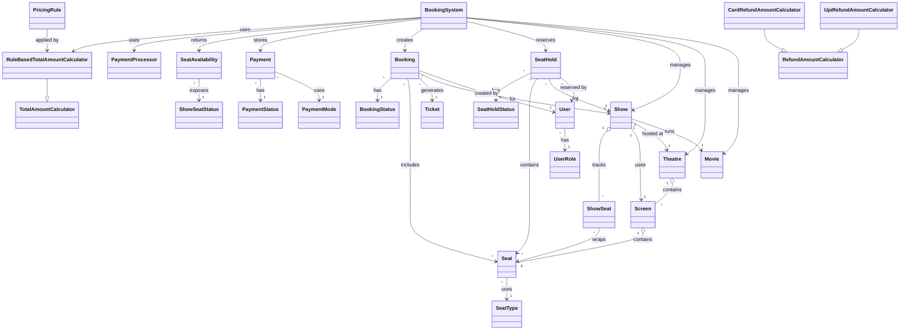

# Movie Ticket Booking System

This project is a Java-based movie ticket booking system designed around the requirements of admin setup, movie-first browsing, theatre-first browsing, seat reservation, payment, ticket generation, cancellation, and refund to the original payment method.

## Key Features

- Admin can add movies, theatres, screens, seats, and shows
- Customer can browse theatres in a city
- Customer can browse movies in a city
- Customer can follow movie-first or theatre-first booking flow
- Seat selection is handled through a seat-map API
- Seats are reserved for a limited time before payment
- Reserved seats are released automatically after timeout
- Payment is separated from seat reservation
- Pricing is rule-based and supports seat-level plus show-level conditions
- Refund goes through the original payment mode

## Supported Flows

### Movie-first flow

1. `showTheatre(city)`
2. `showMovie(city)`
3. `showShowsForMovie(city, movieId)`
4. `showSeatMap(showId)`
5. `reserveSeats(user, showId, seatIds)`
6. `showPaymentOptions()`
7. `makePayment(user, holdId, paymentMode)`

### Theatre-first flow

1. `showTheatre(city)`
2. `showMoviesInTheatre(theatreId)`
3. `showShowsInTheatre(theatreId, movieId)`
4. `showSeatMap(showId)`
5. `reserveSeats(user, showId, seatIds)`
6. `showPaymentOptions()`
7. `makePayment(user, holdId, paymentMode)`

### Direct ticket API

- `bookTicket(user, showId, seatIds, paymentMode)` reserves seats, processes payment, and returns a `Ticket`

### Admin APIs

- `addMovie(...)`
- `addTheatre(...)`
- `addMovieShow(...)`

## Seat Reservation Rules

- A selected seat moves from `AVAILABLE` to `RESERVED`
- A reservation is kept only for a configured hold duration
- If payment is not completed before expiry, the seat becomes `AVAILABLE` again
- After successful payment, the seat becomes `BOOKED`
- This prevents two users from getting the same seat at checkout time

## Pricing Rules

- Base price comes from `SeatType`
- Pricing rules are applied on top of the base price
- Each rule can inspect both `Show` and `Seat`
- This makes the design flexible for weekend pricing, special shows, premium seat surcharges, festival pricing, and more
- Discount rules are intentionally not supported right now

## Refund Rules

- Cancellation is done through `cancelBooking(user, bookingId)`
- Refund amount is calculated by a refund strategy
- Refund is processed through the original payment mode stored in `Payment`
- Current implementation returns full refund for both UPI and card

## UML Diagram



## Brief Description Of Files

| File | Purpose |
| --- | --- |
| `Main.java` | Demo entry point showing movie-first flow, theatre-first flow, seat hold, payment, cancellation, and direct ticket booking. |
| `BookingSystem.java` | Main service layer that exposes admin APIs, browsing APIs, seat-map APIs, seat hold APIs, payment APIs, and cancellation APIs. |
| `User.java` | Stores user details such as id, name, email, and role. |
| `UserRole.java` | Enum for `ADMIN` and `CUSTOMER`. |
| `Movie.java` | Represents a movie with title, duration, and language. |
| `Theatre.java` | Represents a theatre and stores screens. |
| `Screen.java` | Represents a screen and its seats. |
| `Seat.java` | Represents a physical seat with row, column, and seat type. |
| `SeatType.java` | Enum for seat categories and base prices. |
| `Show.java` | Represents a movie show for a screen at a specific time. |
| `ShowSeat.java` | Tracks per-show seat state such as available, reserved, or booked. |
| `ShowSeatStatus.java` | Enum for seat state inside a show. |
| `SeatHold.java` | Represents a temporary seat reservation before payment. |
| `SeatHoldStatus.java` | Enum for seat hold lifecycle states. |
| `SeatAvailability.java` | DTO-style class returned by seat-map API to describe current seat status. |
| `Ticket.java` | Represents the final movie ticket after successful booking. |
| `Booking.java` | Stores booking details, ticket, total amount, and status. |
| `BookingStatus.java` | Enum for booking lifecycle states. |
| `Payment.java` | Stores payment details like booking id, payment mode, amount, and status. |
| `PaymentMode.java` | Enum for supported payment modes: `UPI` and `CARD`. |
| `PaymentStatus.java` | Enum for payment lifecycle states. |
| `PaymentProcessor.java` | Simulates payment success/failure and refund routing through the original payment mode. |
| `TotalAmountCalculator.java` | Abstract base class for total amount calculation. |
| `RuleBasedTotalAmountCalculator.java` | Calculates total using seat base price plus all matching pricing rules. |
| `PricingRule.java` | Flexible rule class that can inspect both `Show` and `Seat` before applying a surcharge multiplier. |
| `RefundAmountCalculator.java` | Abstract base class for refund strategies. |
| `UpiRefundAmountCalculator.java` | Refund strategy for UPI payments. |
| `CardRefundAmountCalculator.java` | Refund strategy for card payments. |
| `IdGenerator.java` | Utility class for generating prefixed ids. |

## How To Compile

```bash
javac *.java
```

## How To Run

```bash
java Main
```
