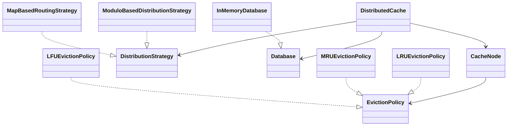

# Distributed Cache

A simple distributed cache implementation in Java, built as part of an LLD assignment.

## Operations supported
- `get(key)` — returns value from cache if present, otherwise fetches from DB, caches it, and returns it
- `put(key, value)` — stores in the correct cache node and also updates the DB (write-through)

## Assumptions
- No real network communication — everything runs in-memory
- Keys are unique
- `put` updates both cache and database (write-through approach)
- If a key doesn't exist in cache or DB, `get` returns null

---

## Design

The design is split into small components so that routing logic and eviction logic can be swapped independently.

### How keys are distributed across nodes

Every `get` and `put` call goes through a `DistributionStrategy` which returns the index of the node responsible for that key. Currently using `ModuloBasedDistributionStrategy` which does:

```
nodeIndex = abs(hash(key)) % totalNodes
```

`MapBasedRoutingStrategy` is another option — you manually assign which keys go to which node, and it falls back to modulo for any key not in the map.

Since both implement the same `DistributionStrategy` interface, you can plug in consistent hashing later without changing anything else.

### Cache miss handling

1. Find the responsible node using the distribution strategy
2. Try to get the value from that node
3. If found → return it (cache hit)
4. If not found → fetch from DB, store in the node, return it (cache miss)

### Eviction

Each node has a fixed capacity. When a node is full and a new key comes in, it asks the `EvictionPolicy` which key to remove.

Currently using LRU — the least recently used key gets removed. Every `get` and `put` on a key calls `recordAccess` to keep the ordering updated.

MRU and LFU are also implemented to show that the policy is pluggable.

### Extensibility

- Different routing → implement `DistributionStrategy` and pass it in
- Different eviction → implement `EvictionPolicy` and pass it in as a supplier
- Different storage backend → implement `Database`

---

## Class Diagram



---

## Running

```bash
javac *.java
java Main
```
