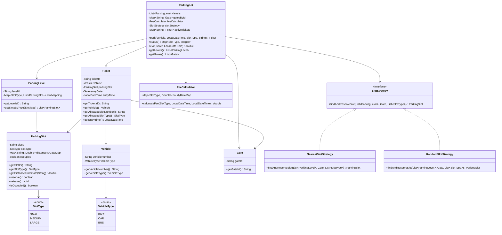

# Multilevel Parking Lot

## Overview

This folder contains a Java implementation of a multilevel parking lot system that supports:

- `SMALL` slots for 2-wheelers
- `MEDIUM` slots for cars
- `LARGE` slots for buses

The implementation now follows the required APIs and rules:

- `park(vehicleDetails, entryTime, requestedSlotType, entryGateID)`
- `status()`
- `exit(parkingTicket, exitTime)`

It also supports the required compatibility rules:

- bike -> `SMALL`, `MEDIUM`, `LARGE`
- car -> `MEDIUM`, `LARGE`
- bus -> `LARGE`

Billing is based on the allocated slot type, not the vehicle type.

## Design Approach

- `ParkingLot` is the main orchestration class.
- `ParkingLevel` groups slots by type across multiple floors.
- `ParkingSlot` stores slot type, occupancy state, and per-gate distance.
- `NearestSlotStrategy` finds the nearest available compatible slot from the entry gate.
- `FeeCalculator` calculates the bill using the allocated slot type and parked duration.
- `Ticket` captures the required entry data: vehicle, slot number, slot type, gate, and entry time.

`requestedSlotType` is treated as the minimum slot type the caller wants. The system then allocates the nearest available compatible slot of that size or larger.

Example:

- a bike requesting `SMALL` can get `SMALL`, `MEDIUM`, or `LARGE`
- a car requesting `MEDIUM` can get `MEDIUM` or `LARGE`
- a bus requesting `LARGE` can get only `LARGE`

## UML Diagram



## File Roles

- `ParkingLot.java`: main API implementation
- `ParkingLevel.java`: one floor of the parking lot
- `ParkingSlot.java`: slot entity with type and distance metadata
- `Ticket.java`: parking ticket data
- `Vehicle.java`, `VehicleType.java`: vehicle model
- `SlotType.java`: slot categories and compatibility
- `Gate.java`: entry gate model
- `SlotStrategy.java`: slot assignment contract
- `NearestSlotStrategy.java`: requirement-compliant allocation strategy
- `RandomSlotStrategy.java`: extra alternate strategy
- `FeeCalculator.java`: pricing logic
- `Main.java`: runnable example
- `InvalidTicketException.java`, `NoSlotAvailableException.java`: domain exceptions

## How To Use

Compile:

```bash
javac *.java
```

Run the sample:

```bash
java Main
```

Typical usage in code:

```java
Ticket ticket = parkingLot.park(vehicle, entryTime, SlotType.MEDIUM, "G1");
Map<SlotType, Integer> availability = parkingLot.status();
double bill = parkingLot.exit(ticket, exitTime);
```
