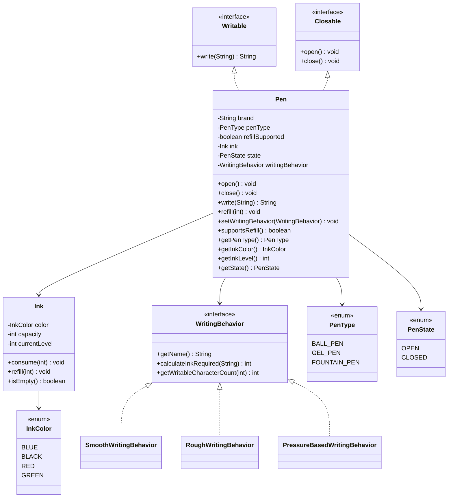

# Pen LLD

## Overview

This folder now uses a simpler design that still covers the requirements:

- write text
- consume ink
- stop when ink is empty
- keep writing behavior independent from pen type
- support runtime behavior change
- support refillable and disposable pens
- support open and closed state

## Approach

- `Pen`: the main class
- `Ink`: manages color, capacity, level, consume, and refill
- `WritingBehavior`: strategy for writing style and ink usage
- `PenType`, `PenState`, `InkColor`: enums for classification and state

## UML Diagram



## How To Use

Compile:

```bash
javac *.java
```

Run:

```bash
java Main
```

Example:

```java
Pen pen = new Pen(
    "Pilot",
    PenType.GEL_PEN,
    new Ink(InkColor.BLACK, 100, 20),
    new SmoothWritingBehavior(),
    true
);

pen.open();
String output = pen.write("Hello");
pen.setWritingBehavior(new PressureBasedWritingBehavior());
pen.refill(10);
pen.close();
```
