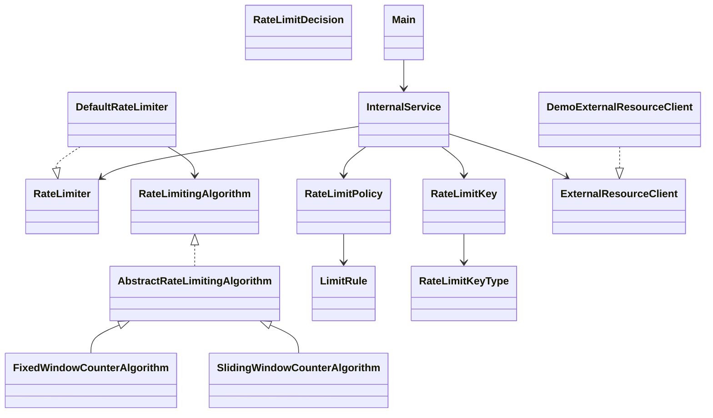

# Pluggable Rate Limiting System — LLD

## Problem

A backend system calls a paid external resource. You are charged per call. Rate limiting should be applied only right before that external call — not on every incoming client request, because not every client request triggers an external call.

---

## Design Overview

The system is built around a strategy pattern. The rate limiting algorithm is a pluggable component. Business code only depends on the `RateLimiter` interface and never directly on any algorithm. Swapping the algorithm means changing one constructor argument — nothing in the service layer changes.

**Core flow:**

```
Client Request
  → Internal Service (business logic runs first)
      → external call needed?
          No  → skip rate limiter entirely
          Yes → RateLimiter.tryAcquire(key, policy)
                  Allowed → call external resource
                  Denied  → return graceful error
```

---

## Classes and Interfaces

**`RateLimiter`** — interface used by business services. Has one method: `tryAcquire(key, policy)`. This is the only thing internal services depend on.

**`DefaultRateLimiter`** — implements `RateLimiter`. Delegates evaluation to whichever `RateLimitingAlgorithm` is injected.

**`RateLimitingAlgorithm`** — strategy interface. Each algorithm implements `evaluate(key, policy)` and `name()`. Adding a new algorithm (token bucket, leaky bucket, sliding log) means implementing this interface only.

**`AbstractRateLimitingAlgorithm`** — base class that handles thread safety and clock management. Subclasses implement `doEvaluate(key, policy, nowMillis)` and focus purely on algorithm logic.

**`FixedWindowCounterAlgorithm`** — fixed window implementation.

**`SlidingWindowCounterAlgorithm`** — sliding window counter with weighted approximation.

**`RateLimitPolicy`** — holds one or more `LimitRule`s under a name. All rules must pass for a request to be allowed (so you can layer constraints like "5 per 10 seconds AND 20 per minute").

**`LimitRule`** — one quota rule: max N requests per time window (e.g. 100 requests per minute).

**`RateLimitKey`** — identifies whose quota is being consumed. Combines a `RateLimitKeyType` (TENANT, CUSTOMER, API_KEY, EXTERNAL_PROVIDER) with an identifier string like "T1".

**`RateLimitDecision`** — result object returned by `tryAcquire`. Caller checks `isAllowed()` and reacts. If denied, it carries which rule was violated and how long to wait before retrying.

**`InternalService`** — shows how business code integrates with the rate limiter. Rate limiting check only happens when an external call is actually needed.

**`ExternalResourceClient`** / **`DemoExternalResourceClient`** — interface and stub for the paid external dependency.

---

## UML Class Diagram



---

## How Algorithm Switching Works

`InternalService` depends only on `RateLimiter`. The algorithm is injected through `DefaultRateLimiter`:

```java
// Fixed window
new DefaultRateLimiter(new FixedWindowCounterAlgorithm())

// Sliding window — InternalService code is identical
new DefaultRateLimiter(new SlidingWindowCounterAlgorithm())
```

`Main.java` demonstrates both running the same scenario with the same service code.

---

## Key Design Decisions

**Strategy pattern for algorithms** — `RateLimitingAlgorithm` is a clean extension point. Future algorithms (token bucket, leaky bucket, etc.) plug in without touching any existing code. This follows the Open/Closed principle.

**Policy and rules are separate from keys** — `RateLimitPolicy` holds the rules, `RateLimitKey` identifies who is being limited. The same policy can apply to different tenants, and the same key can be evaluated against different policies. Keeping them separate makes the system more flexible.

**Thread safety inside the algorithm layer** — each rate limit key gets its own `ReentrantLock` stored in a `ConcurrentHashMap`. Requests from different tenants do not block each other. Only concurrent requests for the same key are serialized. Business code does not deal with synchronization at all.

**Check all rules before incrementing any counter** — if a policy has multiple rules and the request fails rule 3, rules 1 and 2 should not have their counters incremented. The algorithms do a full check pass first and only update state if everything passes.

**Injectable `Clock` for testability** — both algorithm constructors accept a `Clock`. Tests can pass `Clock.fixed(...)` to control time exactly, so tests do not need `Thread.sleep` or deal with flaky timing.

---

## Trade-offs: Fixed Window vs Sliding Window Counter

### Fixed Window Counter

Divides time into fixed buckets aligned to wall-clock boundaries (e.g. a 1-minute window always starts at :00). A counter tracks requests in the current bucket and resets when the bucket rolls over.

**Weakness:** a user can send N requests at the end of one window and N more at the start of the next, getting 2N requests in a very short span. This is the boundary burst problem.

Pros:
- Simple to understand and implement
- O(1) memory per key
- Very fast — just a counter increment and a window check

Cons:
- Boundary burst: up to 2x the configured limit can pass in a short window around the boundary
- Less accurate near window transitions

### Sliding Window Counter

Instead of hard resets, this blends the previous window's count into the current estimate proportionally. If we are 30% into the current window, then 70% of the previous window is still within the last-N-seconds lookback.

```
estimated = currentCount + (previousCount × (1 - elapsed / windowSize))
```

This is an approximation — it assumes requests in the previous window were evenly distributed. In practice this is accurate enough for most use cases and is much smoother than fixed window.

Pros:
- Handles boundary bursts much better
- Still O(1) memory per key (unlike sliding log which stores every timestamp)
- More accurate rate enforcement over time

Cons:
- Slightly more complex
- The count is an estimate, not exact — rare edge cases can still allow or deny by a small margin

**Summary:** fixed window is simpler and faster; sliding window counter is more accurate without the memory cost of sliding log. For most production rate limiting on paid external resources, sliding window counter is the better default.

---

## How to Run

```bash
javac *.java
java Main
```

The demo runs tenant T1 with a limit of 5 external calls per 10 seconds. One request does not need an external call and is never rate-limited. The next 5 external calls are allowed. The 6th is denied. Both Fixed Window and Sliding Window are shown with the same service code.
