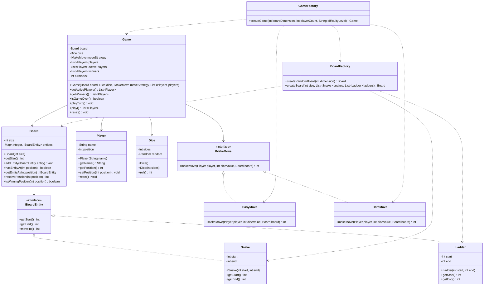

# Snake and Ladder

## Brief Explanation

This project is a Java implementation of Snake and Ladder built with simple object-oriented classes.

Current behavior in the code:

- The user enters `n`, player count, and difficulty level.
- The board contains cells from `1` to `n^2`.
- `BoardFactory` creates `n` snakes and `n` ladders randomly.
- Players start outside the board at position `0`.
- A six-sided dice generates random moves.
- `Snake` moves a player down and `Ladder` moves a player up.
- `EasyMove` keeps the player in the same place if the dice roll crosses the last cell.
- `HardMove` bounces the player back from the last cell if the dice roll crosses it.
- The board rejects snake and ladder placements that would create a cycle.
- Winners leave the game, and play continues until fewer than two players are still trying to win.

## Main Classes

- `Board`: stores total cell count and all snakes/ladders.
- `IBoardEntity`: common contract for snake and ladder positions.
- `Snake`: represents a downward move.
- `Ladder`: represents an upward move.
- `Player`: stores player name and current position.
- `Dice`: rolls a random number from `1` to `6`.
- `IMakeMove`: strategy interface for movement rules.
- `EasyMove`: exact-finish movement rule.
- `HardMove`: bounce-back movement rule.
- `Game`: runs turn-by-turn gameplay and tracks winners.
- `BoardFactory`: creates valid random boards.
- `GameFactory`: creates ready-to-play games from user inputs.

## UML Diagram



## How to Run

Compile:

```bash
javac *.java
```

Run:

```bash
java Game
```
