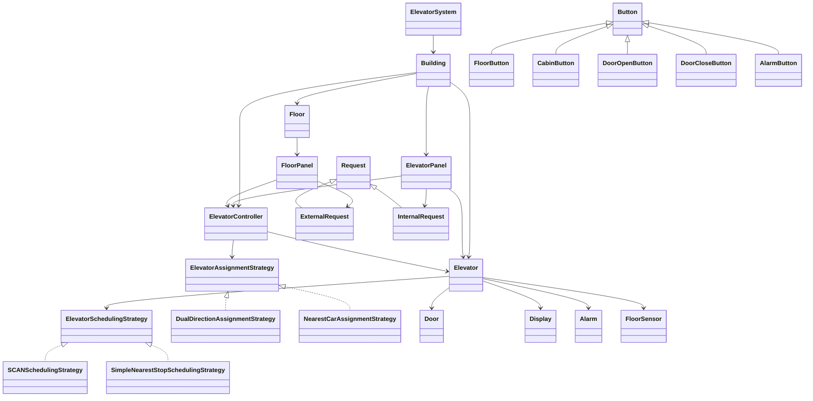

Elevator System LLD
===================

Project summary
---------------
This project is a Low Level Design of a multi-elevator system.
It models how floor requests are created, how a controller assigns those requests to elevators, and how each elevator decides the next stop.

The design is kept modular so assignment logic and scheduling logic can be changed independently.

Main idea / approach
--------------------
- A person presses an outside floor button to create an `ExternalRequest`.
- `ElevatorController` chooses the best elevator using an `ElevatorAssignmentStrategy`.
- Inside the cabin, a person presses a floor button to create an `InternalRequest`.
- Each `Elevator` keeps its pending stops and uses an `ElevatorSchedulingStrategy` to decide movement order.
- Supporting components such as `Door`, `Display`, `Alarm`, and `FloorSensor` keep the design closer to a real elevator system.

Key features
------------
- Multiple elevators
- External hall requests and internal cabin requests
- Separate assignment and scheduling strategies
- Door open/close support
- Alarm-based emergency stop
- Sensor-based current floor tracking
- Validation for invalid hall requests at top and ground floors

UML class diagram
-----------------
The following Mermaid diagram shows the high-level class relationships.

Brief file description
----------------------
- `Main.java`: demo program that creates the building and runs sample requests.
- `ElevatorSystem.java`: top-level wrapper used to progress the simulation with `tick()`.
- `Building.java`: creates and stores floors, elevators, panels, and the controller.
- `ElevatorController.java`: receives external requests, assigns elevators, and steps all elevators.
- `Elevator.java`: core class that manages elevator movement, stops, door actions, and state.
- `Floor.java`: represents a floor in the building.
- `FloorPanel.java`: contains the outside `UP` and `DOWN` buttons for a floor.
- `ElevatorPanel.java`: contains internal cabin buttons such as floor selection, door open/close, and alarm.
- `Request.java`: base class for all requests.
- `ExternalRequest.java`: request created from a floor panel.
- `InternalRequest.java`: request created from an elevator panel.
- `ElevatorAssignmentStrategy.java`: interface for elevator assignment logic.
- `DualDirectionAssignmentStrategy.java`: prefers elevators already moving in the requested direction.
- `NearestCarAssignmentStrategy.java`: assigns the physically nearest elevator.
- `ElevatorSchedulingStrategy.java`: interface for next-stop selection inside an elevator.
- `SCANSchedulingStrategy.java`: scan-like scheduling that continues in the current direction before switching.
- `SimpleNearestStopSchedulingStrategy.java`: chooses the nearest pending stop.
- `Button.java`: base class for all buttons.
- `FloorButton.java`: hall-call button for `UP` or `DOWN`.
- `CabinButton.java`: cabin floor-selection button.
- `DoorOpenButton.java`: cabin button to open the door.
- `DoorCloseButton.java`: cabin button to close the door.
- `AlarmButton.java`: cabin button to trigger emergency alarm.
- `Door.java`: models elevator door state.
- `Display.java`: shows elevator id, floor, direction, and state.
- `Alarm.java`: models alarm activation and stop behavior.
- `FloorSensor.java`: updates and returns sensed floor position.
- `Direction.java`: enum for `UP`, `DOWN`, and `IDLE`.
- `ElevatorState.java`: enum for elevator movement and emergency states.
- `ButtonType.java`: enum for button categories.

How the flow works
------------------
1. A user presses a hall button on a floor.
2. `FloorPanel` sends an `ExternalRequest` to `ElevatorController`.
3. `ElevatorController` selects an elevator using the active assignment strategy.
4. The chosen elevator stores the stop in `upStops` or `downStops`.
5. On each `tick()`, every elevator moves one step based on its scheduling strategy.
6. Inside the cabin, users can raise `InternalRequest`s using `ElevatorPanel`.

How to run
----------
1. Compile all files:
   `javac *.java`
2. Run the project:
   `java -cp . Main`
